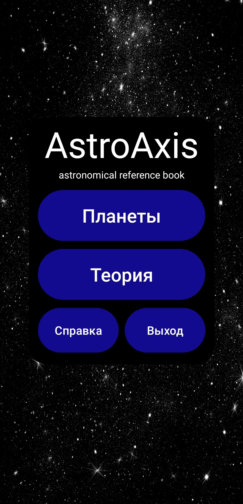
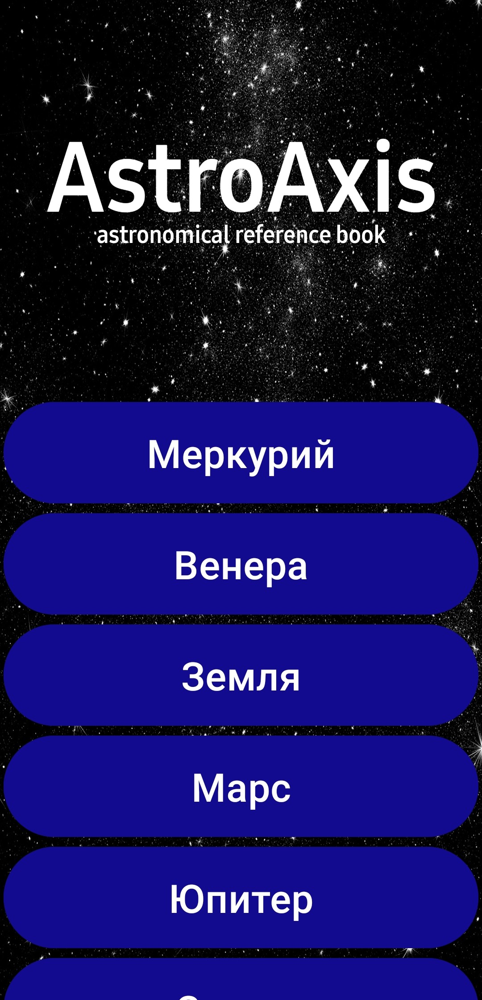
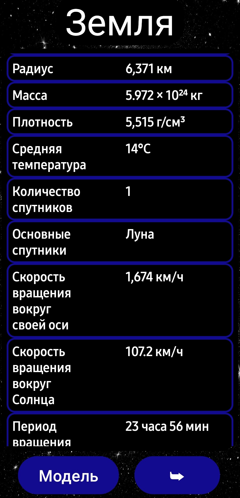
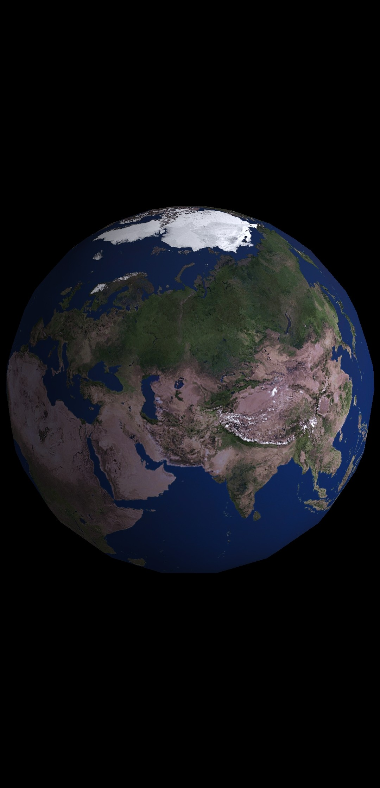
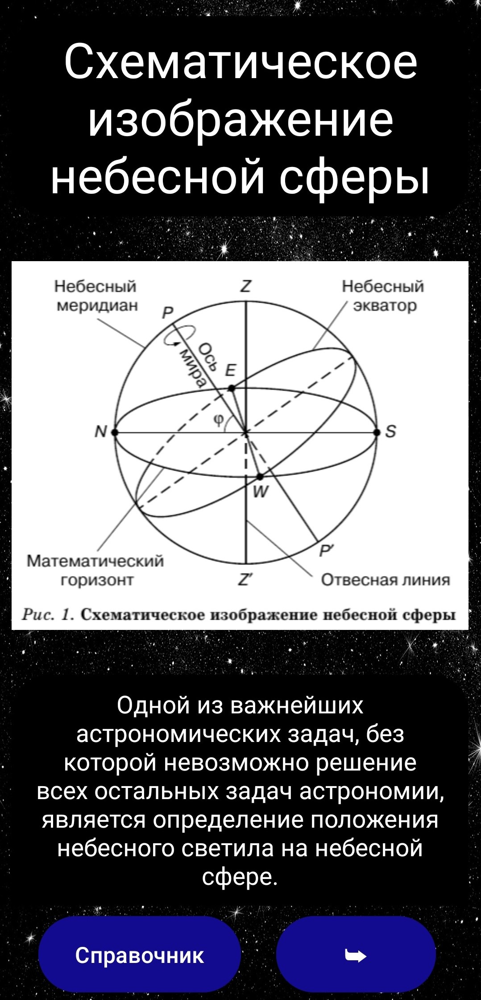
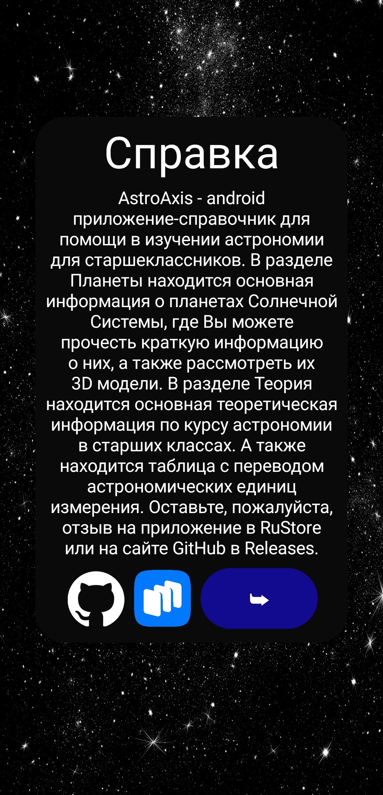

# Mobile Android application
<a name="up"></a>
# AstroAxis astronomical reference book

The project is written on the [LibGDX](https://libgdx.com) framework. 
The backend is written in [Java](https://www.java.com).

AstroAxis is an android reference application to help high school students learn astronomy.
The Planets section contains basic information about the planets of the Solar System,
where you can read brief information about them, as well as consider their 3D models.
The Theory section contains basic theoretical information on the astronomy course in high school.
There is also a table with the translation of astronomical units of measurement.

___

### [Lebedev Sergey Vyacheslav](https://github.com/LebedevSergeyVach) – Product Lead & Fullstack Java-Developer.
### The application is available for installation in the app store [RuStore](https://www.rustore.ru/catalog/app/com.astro.axis.planet.libgdx).

---

## Download a project and deployment.

Download and open the project in Android Studio, install all the necessary packages 
when initializing build.gradle, compile the project on an Android device.

```commandline
git clone git@github.com:LebedevSergeyVach/AstroAxis.git
```
---

### Downloading the main stable version of the mobile application [AstroAxis](https://github.com/LebedevSergeyVach/AstroAxis/releases/download/Main/AstroAxis.apk).
### Description of the release of the main stable version of the mobile application [AstroAxisRelease](https://github.com/LebedevSergeyVach/AstroAxis/releases/tag/Main).

---

### View the UML class diagram of the project on the website [app.diagrams.net](https://app.diagrams.net/?page-id=C5RBs43oDa-KdzZeNtuy&hide-pages=1#HLebedevSergeyVach%2FAstroAxis%2Fmain%2FUML%20class%20diagram.drawio).
### View images of UML class diagrams [UML class diagram-Classes](UML%2FUML%20class%20diagram-Classes.drawio.png) and activities [UML class diagram-Activity](UML%2FUML%20class%20diagram-Activity.drawio.png).
### View images of the mobile application [AstroAxis](#images)

---

Project on the course «Java Development for mobile devices» 
Samsung Innovation Campus at [Samsung IT-Cube school](https://innovationcampus.ru/itschool/).

---

#### [README](README.md) [UP](#up)

---

# Мобильное Android приложение
<a name="вверх"></a>
# Астрономический справочник AstroAxis

Проект написан с помощью фреймворка [LibGDX](https://libgdx.com). 
Бэк часть написана на [Java](https://www.java.com).

AstroAxis - android приложение-справочник для помощи в изучении астрономии для старшеклассников.
В разделе Планеты находится основная информация о планетах Солнечной Системы,
где Вы можете прочесть краткую информацию о них, а также рассмотреть их 3D модели.
В разделе Теория находится основная теоретическая информация по курсу астрономии в старших классах.
А также находится таблица с переводом астрономических единиц измерения.

___

### [Лебедев Сергей Вячеславович](https://github.com/LebedevSergeyVach) – Руководитель продукта и Fullstack Java-разработчик.
### Приложения доступно к установке в магазине приложений [RuStore](https://www.rustore.ru/catalog/app/com.astro.axis.planet.libgdx).

---

## Установка и развёртывание проекта.
Загрузите и откройте проект в Android Studio, установите все необходимые пакеты 
при инициализации build.gradle, скомпилируйте проект на устройстве Android.

```commandline
git clone git@github.com:LebedevSergeyVach/AstroAxis.git
```
---

### Загрузка основной стабильной версии мобильного приложения [AstroAxis](https://github.com/LebedevSergeyVach/AstroAxis/releases/download/Main/AstroAxis.apk).
### Описание релиза основной стабильной версии мобильного приложения [AstroAxisRelease](https://github.com/LebedevSergeyVach/AstroAxis/releases/tag/Main).

---

### Посмотреть UML диаграмму классов проекта на сайте [app.diagrams.net](https://app.diagrams.net/?page-id=C5RBs43oDa-KdzZeNtuy&hide-pages=1#HLebedevSergeyVach%2FAstroAxis%2Fmain%2FUML%20class%20diagram.drawio). 
### Посмотреть изображения UML диаграммы классов [UML class diagram-Classes.drawio.png](UML%2FUML%20class%20diagram-Classes.drawio.png) и активностей [UML class diagram-Activity.drawio.png](UML%2FUML%20class%20diagram-Activity.drawio.png).
### Посмотреть изображения мобильного приложения [AstroAxis](#images)

---

Проект по курсу «Мобильная разработка на Java» 
Samsung Innovation Campus в [Samsung IT-Cube school](https://innovationcampus.ru/itschool/).

---

#### [README](README.md) [ВВЕРХ](#вверх)

---

<a name="images"></a>
## Images mobile application of the AstroAxis

<div style="display: flex; justify-content: space-between; align-items: center;">
  
  
  
  
  
  
</div>

---
